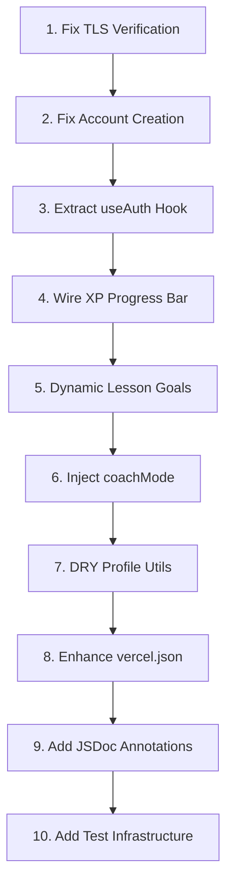

# Heureka (Socratic AI Coach) — Full Cleanup Plan

## Overview

This plan addresses 10 issues identified during a full codebase review, ordered by priority: security → data integrity → architecture → UX → code quality → DX.

---

## 1. HIGH: Fix TLS Verification in Chat API Route

**File:** [`src/app/api/chat/route.js`](src/app/api/chat/route.js:45)

**Problem:** The `undici` `Agent` is configured with `connect: { rejectUnauthorized: false }`, which disables TLS certificate validation. This means the app will accept any certificate from OpenRouter, including forged ones, making it vulnerable to man-in-the-middle attacks.

**Fix:** Remove the custom `Agent` entirely. `undici.fetch` uses Node.js's built-in TLS validation by default, which is secure. The `dispatcher` option should only be used if there's a specific proxy or custom CA requirement.

**Before:**
```js
const response = await undiciFetch("https://openrouter.ai/api/v1/chat/completions", {
  method: "POST",
  dispatcher: new Agent({ connect: { rejectUnauthorized: false } }),
  // ...
});
```

**After:**
```js
const response = await undiciFetch("https://openrouter.ai/api/v1/chat/completions", {
  method: "POST",
  // dispatcher removed — uses secure defaults
  // ...
});
```

Also remove the unused `Agent` import at line 1.

---

## 2. HIGH: Fix Account Creation Data Integrity

**File:** [`src/app/page.js`](src/app/page.js:74)

**Problem:** `handleCreateAccount` uses `setDoc` with `{ merge: true }`. If a user document already exists (e.g., from a prior Google sign-in), the new email/password auth will silently merge into the existing document rather than detecting the conflict. This could allow account takeover or data corruption.

**Fix:** Before creating the account, check if a document already exists for that UID. If it does, throw an error. Use `create` instead of `setDoc` with merge, or explicitly check first.

**Implementation:**
```js
// Before creating, check for existing doc
const existingDoc = await getDoc(doc(db, "users", uid));
if (existingDoc.exists()) {
  setError("An account with this email already exists. Please log in instead.");
  setLoading(false);
  return;
}

// Then use setDoc WITHOUT merge (or use create)
await setDoc(doc(db, "users", uid), {
  name: name.trim(),
  email: email.trim().toLowerCase(),
  role,
  level: role === "teacher" ? 3 : 1,
  xp: role === "teacher" ? 100 : 0,
  motivation: role === "teacher" ? "leadership" : "curious",
  createdAt: new Date().toISOString(),
});
```

---

## 3. MEDIUM: Extract Shared Auth Guard into Reusable Hook

**Files affected:**
- [`src/app/student/page.js`](src/app/student/page.js:40-69)
- [`src/app/student/profile/page.js`](src/app/student/profile/page.js:50-91)
- [`src/app/teacher/page.js`](src/app/teacher/page.js:29-46)

**Problem:** Every page duplicates ~30-40 lines of `onAuthStateChanged` + role check + redirect logic. This is brittle and hard to maintain.

**Fix:** Create a `useAuth` hook at `src/lib/useAuth.js` that:
- Listens to `onAuthStateChanged`
- Fetches the user document from Firestore
- Returns `{ user, profile, loading, error }`
- Accepts an `allowedRoles` array and auto-redirects if the role doesn't match
- Accepts an optional `allowTeacherView` flag for student pages

**Hook signature:**
```js
function useAuth({ allowedRoles = [], allowTeacherView = false } = {})
// Returns: { user, profile, loading, error, isTeacherView }
```

**Usage in student page:**
```js
const { user, profile, loading, isTeacherView } = useAuth({
  allowedRoles: ["student"],
  allowTeacherView: true,
});
```

**Usage in teacher page:**
```js
const { user, profile, loading } = useAuth({
  allowedRoles: ["teacher"],
});
```

---

## 4. MEDIUM: Wire Up XP Progress Bar

**File:** [`src/app/student/page.js`](src/app/student/page.js:171-173)

**Problem:** The XP progress bar is hardcoded to `w-0` (0% width). It never reflects the student's actual XP. The bar exists visually but is non-functional.

**Fix:** Calculate the XP percentage from the student's profile data and apply it as a dynamic width.

**Implementation:**
```jsx
const xpPercent = Math.min(((studentProfile?.xp || 0) % 100), 100);
// ...
<div className="mt-3 h-2 w-40 overflow-hidden rounded-full bg-slate-700">
  <div
    className="h-full rounded-full bg-cyan-400 transition-all duration-500"
    style={{ width: `${xpPercent}%` }}
  />
</div>
```

Also consider: the XP system needs a mechanism to actually award XP. Currently there's no code that increments XP after coaching interactions. This could be a follow-up feature.

---

## 5. MEDIUM: Make Teacher Lesson Goal Dynamic

**File:** [`src/app/teacher/page.js`](src/app/teacher/page.js:49-62)

**Problem:** The lesson goal is hardcoded to save to `systemConfig/English10`. There's no way to set goals for other subjects or classes.

**Fix:** Add a subject/class selector to the teacher dashboard. The teacher picks a class (or creates one), and the goal saves to `systemConfig/{classId}`.

**Implementation:**
- Add a dropdown or text input for class name (e.g., "English 10", "Math 9", "History 11")
- Save to `systemConfig/{classId}` instead of hardcoded `"English10"`
- Load existing goal when switching classes
- Consider storing class list in a `classes` subcollection or the teacher's user document

**Minimal version:** Replace the hardcoded `"English10"` with a state variable `classId` that defaults to `"English10"` but can be changed via a text input.

---

## 6. MEDIUM: Inject coachMode into System Prompt

**Files:**
- [`src/app/student/page.js`](src/app/student/page.js:96-122) — sends `coachMode` in the request body
- [`src/app/api/chat/route.js`](src/app/api/chat/route.js:6-23) — builds system message but never uses `coachMode`
- [`src/lib/prompts.js`](src/lib/prompts.js:59-62) — references "selected coach mode" but has no placeholder

**Problem:** The student page sends `coachMode` to the API, but the API route never reads it from the request body or injects it into the system prompt. The coach tone buttons (Encouraging, Humourous, Reflective, Gentle, Challenge) have no effect.

**Fix:**
1. In [`src/app/api/chat/route.js`](src/app/api/chat/route.js:6), destructure `coachMode` from the request body
2. Replace the generic "Use the selected coach mode" line in the prompt with the actual mode
3. Add a dynamic instruction based on the mode value

**Implementation in route.js:**
```js
const { messageHistory, profileContext, currentTaskContext, coachMode } = await req.json();

const coachModeInstruction = {
  encouraging: "You are in ENCOURAGING mode. Be warm, affirming, and supportive. Celebrate effort and progress.",
  humourous: "You are in HUMOUROUS mode. Be light, playful, and use low-key Gen Z-adjacent humour. Never cringe or overdone.",
  reflective: "You are in REFLECTIVE mode. Be calm, probing, and help the student think deeply about their own thinking.",
  gentle: "You are in GENTLE mode. Be soft, reassuring, and patient. Reduce pressure and build confidence.",
  challenge: "You are in CHALLENGE mode. Be direct, push deeper thinking, and stretch the student beyond their comfort zone.",
}[coachMode] || "You are in GENTLE mode. Be soft, reassuring, and patient.";

// Add to systemMessage
const systemMessage = [
  SOCRATIC_MASTER_PROMPT,
  `\nCOACH MODE: ${coachModeInstruction}`,
  // ... rest
].join("\n");
```

Also update [`src/lib/prompts.js`](src/lib/prompts.js:59-62) to use a placeholder like `{COACH_MODE}` that gets replaced at runtime.

---

## 7. LOW: DRY Up Subject/Assignment Resolution Logic

**Files:**
- [`src/app/student/page.js`](src/app/student/page.js:75-86) and lines 137-148
- [`src/app/student/profile/page.js`](src/app/student/profile/page.js:10-33) and lines 146-151

**Problem:** The logic for parsing subjects from a string/array, resolving the active subject, finding assignments, and selecting the active assignment is duplicated in multiple places across both files. The `normalizeTaskEntries` function in profile is also a candidate for extraction.

**Fix:** Create a utility module at `src/lib/profileUtils.js` with:

```js
// Parse subjects string or array into a clean array
export function parseSubjects(subjects) { ... }

// Normalize task entries for a list of subjects
export function normalizeTaskEntries(taskEntries, subjectList, legacyTaskSheet, legacyCriteria) { ... }

// Resolve the active subject and assignment from profile data
export function resolveActiveContext(profile, activeSubject, activeAssignmentName) { ... }
```

Then import and use these in both the chat page and profile page.

---

## 8. LOW: Enhance vercel.json

**File:** [`vercel.json`](vercel.json:1)

**Problem:** The config is bare — only specifies `version: 2`. No environment variable mapping, region configuration, or function settings.

**Fix:** Add:
- Environment variable declarations for documentation
- Function region (e.g., `syd1` for Sydney to reduce latency for Australian users)
- Function max duration for the chat API route
- Cron job config if needed later

**Implementation:**
```json
{
  "version": 2,
  "regions": ["syd1"],
  "functions": {
    "src/app/api/chat/route.js": {
      "maxDuration": 30
    }
  },
  "env": {
    "NEXT_PUBLIC_FIREBASE_API_KEY": "@firebase-api-key",
    "NEXT_PUBLIC_FIREBASE_AUTH_DOMAIN": "@firebase-auth-domain",
    "NEXT_PUBLIC_FIREBASE_PROJECT_ID": "@firebase-project-id",
    "NEXT_PUBLIC_FIREBASE_STORAGE_BUCKET": "@firebase-storage-bucket",
    "NEXT_PUBLIC_FIREBASE_MESSAGING_SENDER_ID": "@firebase-messaging-sender-id",
    "NEXT_PUBLIC_FIREBASE_APP_ID": "@firebase-app-id",
    "OPENROUTER_API_KEY": "@openrouter-api-key",
    "NEXT_PUBLIC_TEACHER_SIGNUP_CODE": "@teacher-signup-code"
  }
}
```

---

## 9. LOW: Add JSDoc Type Annotations

**Files:** All source files in `src/`

**Problem:** The project is plain JavaScript with no type safety. While a full TypeScript migration is a larger effort, adding JSDoc annotations provides immediate DX benefits (VS Code IntelliSense, parameter hints, return types) without changing the runtime.

**Fix:** Add JSDoc to:
- All exported functions (params, returns)
- The `useAuth` hook (once created)
- The profile utility functions (once created)
- The chat API route handler
- Firebase config (type the config object)

**Example:**
```js
/**
 * @param {Object} options
 * @param {string[]} options.allowedRoles - Roles permitted to access the page
 * @param {boolean} [options.allowTeacherView=false] - Whether teachers can impersonate
 * @returns {{ user: import('firebase/auth').User | null, profile: Object | null, loading: boolean, error: string, isTeacherView: boolean }}
 */
export function useAuth({ allowedRoles = [], allowTeacherView = false } = {}) { ... }
```

---

## 10. LOW: Add Basic Test Infrastructure

**Problem:** The project has zero tests. No test runner, no test files, no testing configuration.

**Fix:** Add Vitest (faster, Vite-native, compatible with Next.js) and React Testing Library.

**Steps:**
1. Install dev dependencies:
   ```bash
   npm install -D vitest @testing-library/react @testing-library/jest-dom @testing-library/user-event jsdom
   ```

2. Add `vitest.config.js`:
   ```js
   import { defineConfig } from 'vitest/config';
   import path from 'path';

   export default defineConfig({
     test: {
       environment: 'jsdom',
       setupFiles: ['./test/setup.js'],
     },
     resolve: {
       alias: {
         '@': path.resolve(__dirname, './src'),
       },
     },
   });
   ```

3. Add `test/setup.js`:
   ```js
   import '@testing-library/jest-dom/vitest';
   ```

4. Add test scripts to `package.json`:
   ```json
   "test": "vitest",
   "test:run": "vitest run"
   ```

5. Write initial tests for:
   - `src/lib/prompts.js` — verify prompt structure, tier rules
   - `src/lib/profileUtils.js` — verify subject parsing, task entry normalization
   - `src/app/page.js` — basic render test for auth page

---

## Execution Order



Items 1-2 are security-critical and must be done first. Items 3-6 are the core functional improvements. Items 7-10 are quality-of-life and DX improvements that build on the earlier changes.

---

## Files That Will Be Created

| File | Purpose |
|------|---------|
| `src/lib/useAuth.js` | Shared auth guard hook |
| `src/lib/profileUtils.js` | Subject/assignment resolution utilities |
| `vitest.config.js` | Test runner configuration |
| `test/setup.js` | Test environment setup |
| `src/lib/__tests__/prompts.test.js` | Prompt validation tests |
| `src/lib/__tests__/profileUtils.test.js` | Utility function tests |

## Files That Will Be Modified

| File | Changes |
|------|---------|
| `src/app/api/chat/route.js` | Remove TLS bypass, inject coachMode |
| `src/app/page.js` | Fix account creation, add JSDoc |
| `src/app/student/page.js` | Use useAuth hook, wire XP bar, use profileUtils, add JSDoc |
| `src/app/student/profile/page.js` | Use useAuth hook, use profileUtils, add JSDoc |
| `src/app/teacher/page.js` | Use useAuth hook, dynamic lesson goals, add JSDoc |
| `src/lib/prompts.js` | Add coachMode placeholder |
| `src/lib/firebase.js` | Add JSDoc |
| `vercel.json` | Add regions, env, function config |
| `package.json` | Add test scripts and devDependencies |
