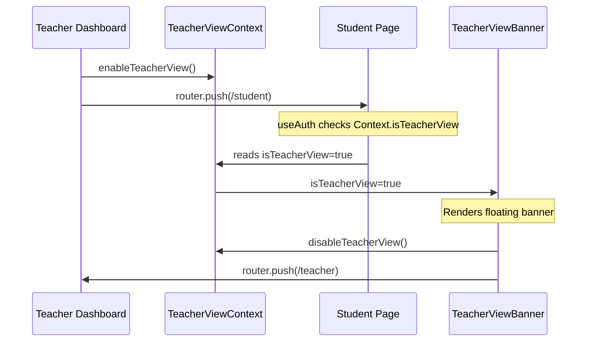

# Teacher Student-View Toggle — Implementation Plan

## Overview

Add a persistent "student view" mode for teachers that lets them browse student-facing pages while remaining logged in as a teacher. A floating banner appears on all pages while in this mode, with a button to switch back to teacher mode.

## Architecture

### 1. TeacherViewContext (`src/lib/TeacherViewContext.js`) — NEW FILE

A React Context that provides:
- `isTeacherView: boolean` — whether the teacher is currently in student-view mode
- `enableTeacherView()` — sets the mode on (called from teacher dashboard)
- `disableTeacherView()` — sets the mode off (called from the banner button)

This is a simple client-side state that lives in memory for the session. It does NOT use localStorage — when the teacher logs out and back in, the view resets to normal.

### 2. TeacherViewProvider wraps the app in `layout.js`

The `layout.js` file (server component) will import and wrap with a new client component `Providers.js` that includes the `TeacherViewProvider`. This keeps `layout.js` as a server component while the context provider is a client component.

### 3. TeacherViewBanner (`src/components/TeacherViewBanner.js`) — NEW FILE

A floating banner component that:
- Reads `isTeacherView` from `TeacherViewContext`
- If true, renders a sticky banner at the top of the page with:
  - "You are viewing as a student" message
  - "Switch back to teacher mode" button
- If false, renders nothing
- This banner is included in the root layout so it appears on ALL pages

### 4. Updated `useAuth` hook

Remove the `allowTeacherView` and `isTeacherView` URL-param logic. Instead:
- Accept an optional `requireTeacherView` parameter (default false)
- If `requireTeacherView` is true and the user is a teacher AND `isTeacherView` is true, allow access to student pages
- Read `isTeacherView` from `TeacherViewContext` instead of URL params

### 5. Updated pages

**Teacher Dashboard (`/teacher` page):**
- "Student view" button calls `enableTeacherView()` from context, then navigates to `/student`
- No URL param needed

**Student Chat (`/student` page):**
- Remove `allowTeacherView` and `isTeacherView` from `useAuth` — the banner handles the visual indicator
- Remove the "Back to teacher mode" button from the header (replaced by the global banner)

**Student Profile (`/student/profile` page):**
- Same changes as student chat page
- Remove the "Back to teacher mode" button from the header

## Data Flow



## Files to Create

| File | Purpose |
|------|---------|
| `src/lib/TeacherViewContext.js` | React Context + Provider for teacher view state |
| `src/components/TeacherViewBanner.js` | Floating banner component shown when in student view |
| `src/components/Providers.js` | Client component that wraps children with TeacherViewProvider |

## Files to Modify

| File | Changes |
|------|---------|
| `src/app/layout.js` | Wrap children with `<Providers>` component |
| `src/lib/useAuth.js` | Remove URL-param logic, read from TeacherViewContext instead |
| `src/app/teacher/page.js` | Use `enableTeacherView()` from context instead of URL param |
| `src/app/student/page.js` | Remove `isTeacherView` / `allowTeacherView` logic, remove "Back to teacher" button |
| `src/app/student/profile/page.js` | Remove `isTeacherView` / `allowTeacherView` logic, remove "Back to teacher" button |

## Detailed Implementation Steps

### Step 1: Create `src/lib/TeacherViewContext.js`

```jsx
"use client";

import { createContext, useContext, useState, useCallback } from "react";

const TeacherViewContext = createContext({
  isTeacherView: false,
  enableTeacherView: () => {},
  disableTeacherView: () => {},
});

export function TeacherViewProvider({ children }) {
  const [isTeacherView, setIsTeacherView] = useState(false);

  const enableTeacherView = useCallback(() => setIsTeacherView(true), []);
  const disableTeacherView = useCallback(() => setIsTeacherView(false), []);

  return (
    <TeacherViewContext.Provider value={{ isTeacherView, enableTeacherView, disableTeacherView }}>
      {children}
    </TeacherViewContext.Provider>
  );
}

export function useTeacherView() {
  return useContext(TeacherViewContext);
}
```

### Step 2: Create `src/components/Providers.js`

```jsx
"use client";

import { TeacherViewProvider } from "@/lib/TeacherViewContext";

export default function Providers({ children }) {
  return <TeacherViewProvider>{children}</TeacherViewProvider>;
}
```

### Step 3: Update `src/app/layout.js`

Wrap `{children}` with `<Providers>` component.

### Step 4: Create `src/components/TeacherViewBanner.js`

A sticky banner at the top of the page that:
- Uses `useTeacherView()` to check if in student view mode
- If true, renders a fixed-position banner with "You are viewing as a student" and a "Switch back to teacher mode" button
- The button calls `disableTeacherView()` and navigates to `/teacher`
- Uses the app's existing styling (emerald-500 theme to match teacher colors)

### Step 5: Update `src/lib/useAuth.js`

- Remove the `allowTeacherView` parameter
- Remove the `isTeacherView` URL-param reading logic
- Import and use `useTeacherView()` from the context
- The role check: if the user is a teacher and `isTeacherView` is true, allow access to student pages

### Step 6: Update `src/app/teacher/page.js`

- Import `useTeacherView` from the context
- In the "Student view" button onClick: call `enableTeacherView()` first, then `router.push("/student")`

### Step 7: Update `src/app/student/page.js`

- Remove `isTeacherView` from the `useAuth` destructuring
- Remove the conditional "Back to teacher mode" button block
- The global banner will handle the switch-back functionality

### Step 8: Update `src/app/student/profile/page.js`

- Same changes as student page — remove `isTeacherView` and the conditional button

## Styling Notes

The banner should:
- Use a distinct color (emerald-500/emerald theme to match teacher branding)
- Be fixed/sticky at the top of the viewport
- Have a clear "Switch back" call-to-action button
- Not interfere with page content (use `z-index` and appropriate padding)
- Match the existing design system (rounded-3xl, slate-950 background, etc.)

## Edge Cases

1. **Teacher logs out while in student view** — The context resets on logout since it's in-memory state. On next login, the teacher is in normal teacher mode.
2. **Teacher refreshes the page** — The context resets on refresh (in-memory). The teacher would need to re-enable student view. This is acceptable behavior.
3. **Teacher navigates directly to `/student` without enabling student view** — `useAuth` will check the role and redirect to `/` since the teacher role doesn't match `["student"]` and `isTeacherView` is false.
4. **Multiple tabs** — Each tab has its own context state. This is expected behavior.
